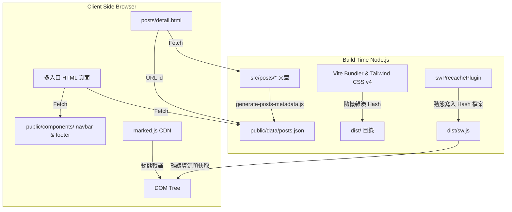

# Jekyll 旅遊部落格遷移至純前端架構設計說明

此設計文件詳細記錄了當前專案從 Jekyll 與 Tailwind CSS v4（Ruby 靜態網站產生器）重構並遷移至**純前端多頁面靜態架構 (Vite + Tailwind CSS v4)** 的設計架構與關鍵決策。

---

## 1. 遷移背景與目標

原本的部落格是一個典型的 Jekyll 靜態網站產生器專案，強烈依賴 Ruby 執行環境與 Bundler 管理 Gem 依賴，這在現代 Node.js 前端開發與部署管線上帶來了額外的維護成本。

重構的目標是**在完全不使用 Ruby / Gem 的情況下，改用現代前端 Vite 工具鏈與 JavaScript 重現本網站所有功能**。

---

## 2. 新前端架構設計 (Vite + Tailwind CSS v4)

遷移後，我們將文章內容、文章索引與版面視圖進行分離，採取以下架構：

### 2.1 資料分離與前端動態渲染

*   **文章索引資料 (`public/data/posts.json`)**：
    利用 Node.js 腳本在打包建置前預先掃描所有文章（Markdown/HTML），將 Front Matter 內容解析成一個小巧的 JSON 陣列。這使首頁和目錄頁在渲染列表時，不需 Fetch 任何全文檔案。
*   **Markdown 解析與 Front Matter 剝離 (`posts/detail.html`)**：
    通用文章詳情頁會在 URL 上獲取文章識別碼（如 `?id=2026-07-11-test`），從 `posts.json` 比對出對應的 Markdown 路徑後進行載入，並使用正則表達式剔除 Front Matter，調用 `marked.min.js` 動態編譯為 HTML 注入，支援 Markdown 與 HTML 雙相容。

### 2.2 共用 Layout 動態載入

為了避免重複代碼，首頁、關於頁、建議頁、目錄頁與文章內頁中，共用的導覽列（Navbar）與頁尾（Footer）已抽離為 `navbar.html` 與 `footer.html` 獨立組件。
當頁面加載時，透過 `assets/scripts.js` 中的通用 Fetch 載入器動態加載並嵌入對應位置，並自動比對當前 URL 將導航項目標記為啟動狀態（Highlight active link）。

### 2.3 PWA 預快取與快取防刷機制

由於 Vite 打包會對靜態資源（CSS、JS）加上防快取雜湊雜湊值（例如 `scripts-STDp5Yn5.js`），為了維持 Service Worker 離線快取的功能，我們設計了自訂的 Vite 插件：
1.  Vite 完成 Bundling 後，插件自動讀取輸出目錄，尋找帶有 Hash 的資源檔名。
2.  將最新的檔名動態更新寫入 `dist/sw.js` 的 `PRECACHE_URLS` 快取陣列中。
3.  同時，插件負責將原始的文章 Markdown/HTML 文件複製到建置輸出目錄。

---

## 3. 重構前後架構對比

| 比較項目 | 舊 Jekyll (Ruby) 架構 | 遷移後純前端 (Vite) 架構 |
| :--- | :--- | :--- |
| **本地依賴** | Ruby, Bundler, Node.js (僅 CSS) | Node.js (100% 純 Node 生態) |
| **文章新增** | 在 `_posts/` 新增檔案 | 在根目錄的 `_posts/` 建立檔案，執行 metadata 生成腳本 |
| **頁面生成** | Jekyll 在後端直接編譯出所有 HTML | 用戶端 JS 讀取 JSON 並 Fetch 文章 Markdown 即時轉譯 |
| **部署方式** | CI (Ruby + Node) -> GitHub Pages | CI (純 Node.js) -> GitHub Pages |
| **共用佈局** | Jekyll `` 語法 | 原生 JS `fetch()` 載入 layout 元件 |
| **離線支援 (PWA)**| 依賴 Liquid 動態變數注入 | 靜態 Base URL 設定搭配自訂 Vite 預快取 Hash 插件 |
