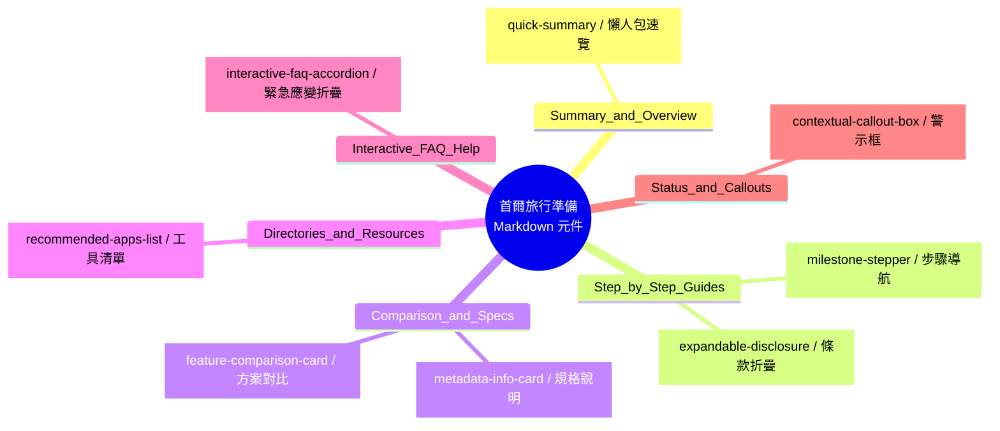

# Markdown 裝飾元件（Decorations）UI/UX 設計分析與語意化命名規範

本報告由 **資深 UI/UX 設計師** 角度出發，深入分析 [2026-07-13-韓國首爾旅行準備.md](../src/posts/2026-07-13-%E9%9F%93%E5%9C%8B%E9%A6%96%E7%88%BE%E6%97%85%E8%A1%8C%E6%BA%96%E5%82%99.md) 中所使用的 Markdown 裝飾元件（Custom Code Blocks 及 HTML 標記），並針對其**資訊架構 (Information Architecture)**、**使用者體驗 (UX)**、以及 **Agent 可讀性 (Agent-Friendliness)** 進行元件化重新命名與重複使用場景提案，作為專案後續設計與寫文的參考規範。

---

## 視覺與互動設計元件總覽



---

## 1. `prep` ➔ `quick-summary`（懶人包速覽）

### 原始語意與結構
*   **原始標記名稱**：`prep` (Preparation 的簡寫)
*   **資料結構**：
    ```markdown
    關鍵字/主題：簡短標題 | 詳細說明與數據。
    ```

### UI/UX 設計解析
*   **視覺焦點**：位於文章最上方，提供「30 秒行前速覽」，屬於典型的 **TL;DR (Too Long; Didn't Read)** 區塊。
*   **版面配置**：左側為高對比的「關鍵字標籤」，右側為「對應的具體方案/關鍵結論」，以直線 `|` 分隔，在畫面上形成清晰的兩欄對齊網格（Grid）。
*   **UX 優點**：使用者不需要讀完幾千字，就能在 10 秒內抓到核心痛點（網路、接駁、現金、違禁品、通關系統）。

### 推薦重複使用場景
1.  **產品說明頁的亮點規格（Specs Highlight）**。
2.  **電子商務的「購物須知 / 退換貨政策簡介」**。
3.  **技術文檔或專案 Readme 的「快速起步關鍵配置（Quick Configs）」**。

### Agent 友善命名與規格
> **新名稱**：`quick-summary` (或 `tldr-cheat-sheet`)
> **Agent 理解指南**：當需要為使用者快速總結一篇文章、一個流程的「最關鍵痛點與結論」時，應使用此元件。

```json
// 解析後的元件資料結構
{
  "component": "quick-summary",
  "items": [
    { "badge": "網路", "summary": "中華電信韓國日租型最划算", "detail": "每日優惠價 NT$99 吃到飽" }
  ]
}
```

---

## 2. `stepper` ➔ `milestone-stepper`（里程碑步驟條）

### 原始語意與結構
*   **原始標記名稱**：`stepper`
*   **資料結構**：使用 `@ 階段標題/時間` 作為錨點，下方接續 Markdown 的有序或無序列表。

### UI/UX 設計解析
*   **視覺焦點**：利用 `@` 將一長串任務切分為「多個里程碑（Milestones）」，並在里程碑內部提供詳細步驟。
*   **版面配置**：在前端渲染時，應呈現為一個**垂直時間軸（Vertical Timeline）**，左側為時間節點（如：桃園機場出發 ➔ 機上飛行 ➔ 抵達仁川），右側為步驟卡片。
*   **UX 優點**：將隨時間變化的複雜流程（如機場通關、WOWPASS 購買與開卡）視覺化，降低使用者的焦慮感，能按圖索驥。

### 推薦重複使用場景
1.  **軟體安裝與設定教學（SaaS Setup Onboarding）**。
2.  **跨國商務或簽證申請流程（Application Workflow）**。
3.  **專案開發里程碑與進度報告（Project Roadmap）**。

### Agent 友善命名與規格
> **新名稱**：`milestone-stepper` (或 `workflow-timeline`)
> **Agent 理解指南**：凡是涉及「有先後順序、時間推移、或多步驟引導」的內容，均應使用此元件。

```markdown
```milestone-stepper
@ 階段一：準備工作 (時間/條件)
1. 步驟 A
2. 步驟 B

@ 階段二：執行階段
...
```
```

---

## 3. `compare` ➔ `feature-comparison-card`（特色對比卡）

### 原始語意與結構
*   **原始標記名稱**：`compare`
*   **資料結構**：
    ```yaml
    name: 方案名稱
    stars: 推薦星等 (★)
    tagline: 一句話核心優勢
    row: 屬性名稱 | 屬性描述
    ```

### UI/UX 設計解析
*   **視覺焦點**：標題、推薦星等（Stars）以及 Tagline。用來快速建立認知，引導使用者做決策。
*   **版面配置**：適合渲染為一個**排版精美的卡片（Card Grid）**。當有多個 `compare` 連續出現時，在桌機版應自動排列為並排的 Grid，方便橫向對比。
*   **UX 優點**：提供明確的評分與決策依據，並透過統一的 `row: Key | Value` 結構，消除文字堆疊的疲勞。

### 推薦重複使用場景
1.  **SaaS 產品價格方案比對（Pricing Plans - Basic / Pro / Enterprise）**。
2.  **硬體/手機規格 PK（Spec Comparison）**。
3.  **解決方案或演算法優缺點評估（A/B Testing Options）**。

### Agent 友善命名與規格
> **新名稱**：`feature-comparison-card` (或 `decision-matrix-card`)
> **Agent 理解指南**：當有多個選項需要提供給使用者做決策，且每個選項都有共同的評比維度（如價格、時間、優缺點、推薦度）時使用。

---

## 4. `info` ➔ `metadata-info-card`（元數據資訊卡）

### 原始語意與結構
*   **原始標記名稱**：`info`
*   **資料結構**：
    - 結構 A（鍵值對）：`name`、`tagline` 搭配多個 `row: Key | Value`。
    - 結構 B（段落型）：`name` 搭配單一的 `text` 或段落。

### UI/UX 設計解析
*   **視覺焦點**：與 `compare` 類似但去除了「推薦星等」，專注於「中立的資訊呈現」。
*   **版面配置**：適合用作側邊欄（Sidebar）、小百科、或者是文章中的強調區塊（Notice/Info block）。
*   **UX 優點**：將非結構化的描述（如：交通禮儀、秋季穿搭、氣候同行卡規定）轉換成結構化卡片，提高文章的「可掃描性（Scannability）」。

### 推薦重複使用場景
1.  **專有名詞定義與小百科（Glossary Card）**。
2.  **API 參數列表說明（API Reference Card）**。
3.  **行前注意事項、溫馨提示（Pro-Tips / Reminders）**。

### Agent 友善命名與規格
> **新名稱**：`metadata-info-card` (用於鍵值對) / `context-notice-card` (用於段落說明)
> **Agent 理解指南**：用來補充核心內容之外的輔助資訊，例如背景知識、注意事項、規則說明。

---

## 5. `apps` ➔ `recommended-apps-list`（工具/資源清單）

### 原始語意與結構
*   **原始標記名稱**：`apps`
*   **資料結構**：
    ```markdown
    單字元Logo/Icon | 應用程式名稱 | 介紹與商店下載 HTML 連結
    ```

### UI/UX 設計解析
*   **視覺焦點**：首字元縮寫（如 N 代表 Naver, T 代表 Kakao T），在前端可渲染為帶有代表色背景的圓形 App 圖示。
*   **版面配置**：列表式，左側為精緻圖示，中間為標題與描述，右側或下方放置 Store 下載連結。
*   **UX 優點**：將雜亂的 URL 連結美化，讓使用者一看就知道該去哪裡下載，且首字元能幫助使用者在手機畫面上快速對照。

### 推薦重複使用場景
1.  **推薦工具鏈 / 設計資源下載清單（Resource Directory）**。
2.  **必備 Chrome 擴充功能推薦（Extension Pack）**。
3.  **團隊成員介紹 / 聯絡人清單（Team Directory）**。

### Agent 友善命名與規格
> **新名稱**：`recommended-apps-list` (或 `resource-link-directory`)
> **Agent 理解指南**：當需要推薦複數的第三方軟體、網站工具、或資源下載點，並需要附帶描述與下載連結時使用。

---

## 6. `accordion` ➔ `interactive-faq-accordion`（互動式折疊面板）

### 原始語意與結構
*   **原始標記名稱**：`accordion`
*   **資料結構**：
    ```yaml
    id: 唯一識別碼
    cat: 分類 (如 medical, police)
    tag: 顯示標籤
    summary: 折疊標題
    (下方為展開後的 Markdown 內容)
    ```

### UI/UX 設計解析
*   **視覺焦點**：標籤（Tag）與摘要標題（Summary）。
*   **版面配置**：可折疊的區塊。前端應提供一個「分類過濾器（Filter tabs）」，使用者可以點選「醫療」、「治安」或「交通」，系統便會即時篩選出對應的折疊項目。
*   **UX 優點**：這是非常強大的**漸進式呈現（Progressive Disclosure）**設計。在緊急狀態下，使用者能透過標籤和過濾器秒速找到對應的就醫或報案專線，而不會被大量的內文淹沒。

### 推薦重複使用場景
1.  **常見問答頁面（Help Center FAQ）**。
2.  **系統錯誤代碼與疑難排解指南（Troubleshooting Guide）**。
3.  **合約條款與隱私權政策分項說明（Terms & Conditions）**。

### Agent 友善命名與規格
> **新名稱**：`interactive-faq-accordion` (或 `emergency-contact-collapse`)
> **Agent 理解指南**：適用於大量的「問題-解答」或「情境-應變方式」清單，特別是需要支援動態篩選或折疊隱藏以節省版面空間時。

---

## 7. `alert-box` ➔ `system-alert-banner`（情境警示框）

### 原始語意與結構
*   **原始標記**：HTML `<div class="alert-box alert-note">` 或 `<div class="alert-box alert-warning">`
*   **UX 類型**：`note` (提示/通知), `warning` (警告/防雷)

### UI/UX 設計解析
*   **視覺焦點**：粗體標題、警告圖示（如 ⚠️、💡）、以及有顏色的背景邊框（如黃色 border 代表 warning，藍色/灰色 border 代表 note）。
*   **UX 優點**：破壞原有的閱讀流（Reading Flow），強迫使用者停下閱讀最重要的政策變更或防雷事項（如醫美退稅取消、行李限重差異）。

### 推薦重複使用場景
1.  **系統維護通知、版本更新說明（System Callout）**。
2.  **操作風險警告、資安風險提示（Security Notice）**。
3.  **考試/申請截止日期提醒（Critical Deadline）**。

### Agent 友善命名與規格
> **新名稱**：`system-alert-banner` (或 `contextual-callout-box`)
> **Agent 理解指南**：為了標準化，建議 Agent 可直接轉換為 GFM（GitHub Flavored Markdown）的 Alert 語法：
> - `> [!NOTE]` ➔ 對應 `alert-note`
> - `> [!WARNING]` 或 `> [!CAUTION]` ➔ 對應 `alert-warning`

---

## 8. `fold` ➔ `expandable-disclosure`（細則折疊）

### 原始語意與結構
*   **原始標記**：HTML `<details class="fold"><summary>標題</summary>內容</details>`

### UI/UX 設計解析
*   **視覺焦點**：標題旁的展開箭頭。
*   **UX 優點**：比起 `accordion` 的結構化 YAML 配置，`fold` 更為輕量，適合直接嵌入在段落文字中，用來收納「非核心但重要的補充細節」（例如理賠上限細則、行李違禁品清單）。

### 推薦重複使用場景
1.  **公式推導過程、程式碼範例展開（Code Block Expand）**。
2.  **法規條文全文、名詞詳細背景資料（Supplementary Details）**。
3.  **防雷頁/劇透折疊（Spoiler Shield）**。

### Agent 友善命名與規格
> **新名稱**：`expandable-disclosure` (或 `collapsible-details-wrapper`)
> **Agent 理解指南**：用於內文中「需要提供，但預設隱藏以保持版面乾淨」的補充資訊。

---

## UI/UX 元件重組對照表

下表彙整了所有元件的重新命名與設計定位，便於 Agent 在讀寫 Markdown 時能瞬間識別並應用於合適的區塊：

| 原始標記 | 推薦新名稱 (Agent-Friendly) | UI/UX 視覺呈現方式 | 適合使用的內容區塊 |
| :--- | :--- | :--- | :--- |
| `prep` | `quick-summary` | 網格欄位 (Grid) / 徽章標籤 (Badges) | 文章開頭、懶人包、核心結論、TL;DR 摘要 |
| `stepper` | `milestone-stepper` | 垂直時間軸 (Vertical Timeline) / 數字步驟卡 | 旅遊通關流程、SaaS 註冊引導、手動設定步驟 |
| `compare` | `feature-comparison-card` | 多欄比較卡片 (Card Grid) / 推薦星等 | 交通方案 PK、SaaS 計費方案對比、產品優缺點評估 |
| `info` | `metadata-info-card` | 側邊欄小百科 / 鍵值對規格卡 | 穿搭建議、氣候卡規定、支付卡特點、名詞定義 |
| `apps` | `recommended-apps-list` | 圓形縮寫 Icon 列表 + 下載按鈕 (App List) | 推薦手機 App、設計工具箱、參考網站連結 |
| `accordion` | `interactive-faq-accordion` | 可過濾分類的手風琴折疊板 (Filter Tabs) | 緊急就醫指南、常見問答 (FAQ)、疑難排解 |
| `alert-box` | `system-alert-banner` | 邊框著色框 / 警示圖示 (Callout) | 醫美退稅新政策、行李限重警告、重要期限提醒 |
| `fold` | `expandable-disclosure` | 原生展開收合組件 (Collapsible Details) | 理賠細則條款、行李違禁品詳情、程式碼附錄 |
