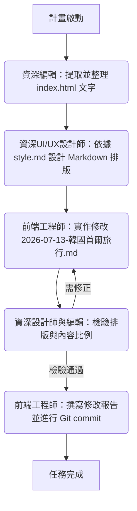

# 📝 韓國首爾旅行部落格文章改良計畫

本計畫旨在改良位於 `src/posts/2026-07-13-韓國首爾旅行.md` 的部落格文章，使其成為一個結構嚴整、排版清晰、方便讀者直接做為完整旅遊攻略的精美文章。我們將依照 [index.html](file:///home/lawrencechh/j/travel_guide/index.html) 的結構進行重組。

---

## 🎯 改良目標
1. **主標題與區塊結構對齊**：依據 [index.html](file:///home/lawrencechh/j/travel_guide/index.html) 的分頁設計，在部落格文章中建立對應的 Markdown 一級或二級標題：
   - 總覽 (Overview)
   - 行前準備 (Preparation)
   - 機場通關 (Airport)
   - 在地景點 (Spots)
   - 美食推薦 (Food)
   - 實用工具 (Useful)
   - 緊急應變 (Emergency)
2. **文字完全比照**：由**資深編輯**逐一對照 [index.html](file:///home/lawrencechh/j/travel_guide/index.html) 內的所有實用說明，精煉且精準地保留文字。
3. **Markdown 排版與風格對齊**：由**資深UI/UX設計師**評估並設計符合 Markdown 特性且對齊整體部落格風格的排版。
   > [!IMPORTANT]
   > **設計風格指引**：設計師將嚴格參考 [style.md](file:///home/lawrencechh/j/travel/doc/style.md)，使用全站的色彩 Token 語意（文字使用冷深灰 `text-ink` / `#222831`、次要字 `text-muted-text`，強調色使用暖褐 `text-primary` / `#6F675B`，邊框使用 `border-sand`），排版上建立雙字型（標題用襯線體 Lora，內文與數據用無襯線體 Inter），且**不加**斜體 `italic`、**不使用** Emoji 圖示、**不使用** `shadow-*` 陰影，以維持與整個部落格品牌風格的完美一致。
4. **程式碼修改與提交**：由**前端工程師**修改實作，編寫修改報告，並進行 Git commit。

---

## 👥 角色分工與協作工作流

我們將啟動多代理人內部協作工作流：

---

## 🛠️ 預計修改內容 (Proposed Changes)

### [Jekyll Blog Post Component]

#### [MODIFY] [2026-07-13-韓國首爾旅行.md](file:///home/lawrencechh/j/travel/src/posts/2026-07-13-韓國首爾旅行.md)
- **保留 Frontmatter**：保留原有的 Jekyll 檔頭設定（標題、layout、日期等）。
- **重構主體內容**：
  - **前言/總覽**：彙整出發日期、來回航廈、同伴背景（家庭成員與休憩處成員）、天氣穿搭與換匯核心原則。
  - **行前準備**：旅遊保險（2026新制）、網路漫遊對比、WOWPASS Step-by-Step 操作、氣候同行卡與行李規定。
  - **機場通關**：入境 4 大步驟（e-Arrival QR Code、檢疫、海關）與回程出境流程（SmartPass 註冊與使用）。
  - **在地景點**：Day 1 到 Day 4 行程點，標示步行難易度與休憩地點。
  - **美食推薦**：將 30 家推薦餐廳按區域整理，以精緻的列點呈現（名稱、地圖連結、價位、招牌菜、休憩處成員適合度與避雷提示）。
  - **實用工具**：App 下載網址、免稅退稅規定、交通禮儀。
  - **緊急應變**：求助電話、外館地址、三大設有國際醫療中心醫院之地址與電話。

---

## 📋 驗收計畫 (Verification Plan)

### 自動檢驗
- 檢查 Markdown 檔案的格式，確保無未閉合的連結、夾鏈或損壞的 Markdown 標記。

### 手動檢驗
- **UI/UX 設計師檢驗**：檢查表格對齊、警告區塊（Alerts）的配置、無 Emoji、視覺比例是否舒適。
- **資深編輯檢驗**：對照 [index.html](file:///home/lawrencechh/j/travel_guide/index.html) 中的資料，確保所有核心細節（包含航班號 KE187、Darakhyu 價格、Chunghwa 漫遊費率、30 家餐廳導航與 避雷提示）一字不差地整合進文章中。
